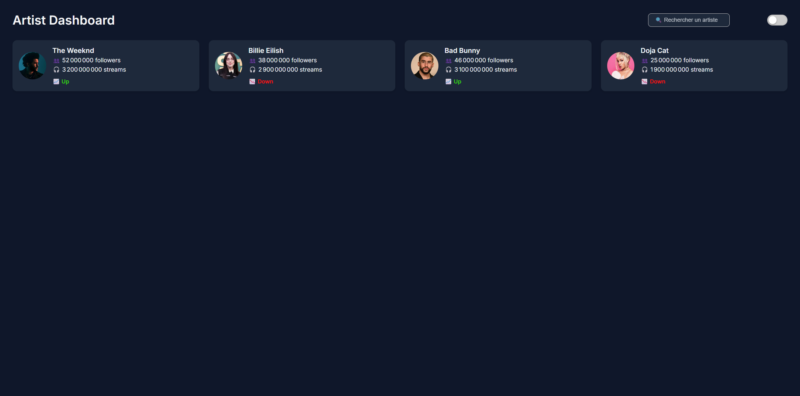

# 🎧 Artist Dashboard 

---

## Démo en ligne

[Voir le dashboard sur Vercel](https://artist-dashboard-one.vercel.app/)

## Maquette Figma

[Figma – Artist Dashboard](https://www.figma.com/design/v0QdFJzF2WpQEXVpZQyrw1/Artist-Dashboard?node-id=0-1&p=f&t=zpaEPn71rwjJsY4l-0)

## Aperçu



---

## 🛠️ Stack technique

- **React + Vite**
- **TypeScript**
- **SCSS Modules**
- **CSS Variables pour le theming**
- **Git Flow propre** (branche feature `toggle`, etc.)

---

## 📂 Structure du projet

src/
├── components/
│ ├── ArtistCard.tsx
│ ├── ToggleButton.tsx
├── data/
│ └── artists.ts
├── styles/
│ ├── Dashboard.scss
│ ├── ToggleButton.scss
├── App.tsx
├── main.tsx

---

## 🚀 Pour lancer le projet en local

```bash
git clone https://github.com/emitaylor/artist-dashboard.git
cd artist-dashboard
npm install
npm run dev
